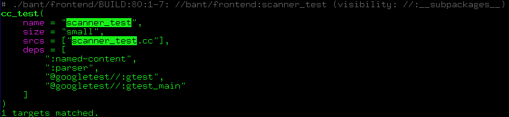

[](https://www.gnu.org/licenses/gpl-3.0.html)
[](https://github.com/hzeller/bant/actions/workflows/ci.yml)

bant - Build Analysis and Navigation Tool
=========================================

Utility to support projects using the [bazel] build system, in particular C++
projects.

Bant
  * Helps [cleaning up BUILD dependencies](#dwyu--depend-on-what-you-use) by
    adding missing, and removing superfluous, dependencies ("`build_cleaner`").
    Emits a `buildozer` script that can be applied to the project.
  * Has a feature to create a [compilation DB](#compilation-db) which should
    work for most medium-complex C++ projects.
  * Helps printing targets [with "grep" feature](#print) that emits the full
    syntax-highlighted rule that matches the regex.
  * Extracts interesting project information such as
    the [dependency graph](#dependency-graph),
    [headers provided by which libraries](#lib-headers) etc., and presents
    them for easy post-processing (outputs simple tables for `grep` or `awk`,
    but as well CSV, JSON and S-Expressions).
  * [Canonicalizes](#canonicalize) targets.
  * Is available in the [Bazel Central Registry][on-bcr] for easy
    [integration in projects](#in-projects) to provide build-cleaner
    or compilation db features.

## Commands

Bant is invoked with a command and a bazel-like pattern such as `...` or
`//foo/bar:all`

```
bant [options] <command> [bazel-target-pattern...]
```

See `bant -h` for general [Synopsis](#synopsis) and available commands.
Commands can be shortened as long as they are unique, e.g. `lib` is
sufficient to invoke `lib-headers`.

Play around with the various `-f` output formats of `workspace`,
`list-packages` etc. for your preferred post-processing tools (default is
just a plain table easy to process with e.g. `awk` and `grep`, but
s-expressions and json are structured outputs interesting in other contexts).

### dwyu : Depend-on What You Use

**`dwyu`** Depend on What You Use (DWYU)[^1]: Determine which dependencies
are needed in `cc_library()`, `cc_binary()`, and `cc_test()` targets.

If a source file `#include`s a header, DWYU determines if the library
that provides that header is mentioned in the `deps = [ ... ]`.

For that, `bant` greps through a target's declared sources to find which
headers they include. Uses the information from `lib-headers` to determine
which libraries these sources thus need to depend on.
Emits [buildozer] commands to 'add' or 'remove' dependencies.
If unclear if a library can be removed, it is conservatively _not_
suggested for removal.

You can use this to clean up existing builds, or keep your BUILD files
up-to-date in development.
I usually just don't even add `deps = [...]` manually anymore but just
let `bant dwyu` do the work.

The following auto-fixes all dependencies of the project:

```bash
. <(bant dwyu ...)   # source the buildozer calls in shell
```

#### Features

If there is a dependency that `bant` would like to remove, but it is needed
for some reason that can't be derived from the include files it provides
(and you can't correctly mark it as `alwayslink` because it is coming
from some external project for instance), you can add a comment that
contains the word 'keep' in the line in question.

```python
cc_library(
  deps = [
    ":foo"  # build_cleaner keep
  ]
)
```
Note, a well-defined project should not need this. This feature provides
an escape hatch if needed. With `-k`, `bant` will be
strict and ignore `# keep` comments and emit the removal edit anyway.

#### Caveats

   * Does not understand package groups in visibility yet; these will be
     considered `//visibility:public` and might result in adding
     dependencies that bazel would not allow.
   * Will remove dependencies if they provide headers that are not needed
     by the sources of a target. If you want to keep them linked, you need to
     declare them as `alwayslink` (libraries that are linked to targets but
     do _not_ provide any headers are considered alwayslink implicitly).
     (this is not really a caveat, it just emphasizes that it is important to
     properly declare the intent in BUILD files).

The `dwyu` command is essentially a [`build_cleaner`][build_cleaner] for
C++ targets.

### compilation-db

Creates a compilation db that can be used by `clang-tidy` or `clangd`.
**Experimental** right now. It is not exactly emitting all the options bazel
would use, and is missing virtual includes (provided by `cc_library()` with
`include_prefix`) so less accurate than tools that make use of bazel actions,
but should work pretty well for a typical bazel project already.

```bash
  bant compilation-db -o compile_commands.json
  # or
  bant compile-flags -o compile_flags.txt
```

### Print

**`print`** is useful to print a particular rule or rules matching a pattern
`bant print //foo/bar:baz` (it is re-created from the AST, so you see
exactly what `bant` sees). In general this is much faster than manually
finding and opening the file, in particular when it is in some external
project where it is harder to even find the right file; consider

```bash
bant print @googletest//:gtest
```

By default, `print` outputs _rules_ matching the pattern, so only these
are printed. You won't see other constructs parsed in the package,
such as variable assignments or unevaluated list-comprehensions that are yet
to build rules.

With `-a` (for AST, or "all", if you will), the _entire_ parsed content of the
surrounding package is printed. Say you have list-comprehensions
that generate rules that you want to see, but don't `-e`laborate yet; you can
use `-a` to show these.

#### Expression evaluation

In the example above you saw that `gtest` has some files `glob()`'d and
other expressions that make that rule, which we want to see evaluated.
With the `-e` option (for `e`laborate), bant can do some basic evaluation
of these and print the final form - here you see the filenames are now expanded:

```bash
bant print -e @googletest//:gtest
```

In general, elaboration is limited right now and only does some
transformations that are immediately useful for dependency analysis;
implemented as need arises (That is why it's called elaboration not evaluation
right now :)). Use `-e` to enable the elaboration in `print`.

Expressions that can be const-evaluated are then replaced with a literal of
the result. Supported are:

  * Variable substitution.
  * `glob()` expansion.
  * List comprehension. This expands list comprehensions used in BUILD files
    to programmatically create lists with a loop. This can be in lists for
    e.g. source files or even toplevel loops creating a bunch of target rules.
  * Some common string methods (`"str".format()`, `"str".join()` and
    `"str".rsplit()`). Also the modulo operator for formatting strings the
    classic way `"str %s %s" % (foo,bar)`.
  * Array accesses.
  * String and list concatenation with `+`.
  * Some basic arithmetic operators.
  * Macro substitution of [builtin-macros] (in a bant-specific syntax) to
    help bant better see through some constructs (used in `dwyu`; to enable
    in printing: use `-b`).

If you suspect an operation is not evaluated, invoke bant with extra verbose
`-vv` - it will show what operations it glossed over (If observed in the field:
good candidate to implement next).

#### Grep
As targets to print, the usual bazel patterns apply, such as exact label names,
`...`, or `:all`; also, some `*`-globbing label names is supported in the
labels in a package (not in the path):

```bash
bant print //bant:*type*
```

The `-g` option allows to 'grep' for targets where the rule-name or any of the
strings in the AST of a rule matches a pattern.

```bash
bant print ... -g "scan.*test"
```

The output contains the full rule matching the grep pattern, highlighted text
if output `isatty()`, the BUILD file, and location where it is found, the
fully qualified name of the target, as well as visibility.



Evaluation of [custom flags] in `select()` also works (partially: see note in
[synopsis](#synopsis) output), and similar to
`bazel`, you pass these options with `--//...` to bant; let's use that
to evaluate the effective content of the following rule:


```bash
bant -e --//bant:static_linked_executables print bant:bant
```

### Workspace

**`workspace`** prints all the external projects found in the workspace.

```bash
bant workspace   # All external projects referenced in this workspace
```

If you give a pattern, it will only print external projects used
by targets matching the pattern:

```bash
bant workspace ...        # Print projects referenced in your project
bant workspace @re2//...  # Print projects referenced by re2
```

### list-targets, list-leafs

#### list-targets
If you want to find the file quickly, `bant list-target //foo/bar:baz`
will output the filename and exact line/column range where the target
resides.

```bash
bant list-targets //...     # list all targets of current project
bant list-targets -r //...  # also recursively following all dependencies
```

If `-b` is given, the built-in macros are applied, so special rules are
expanded, making more obscure rules become `genrule` and `cc_library`.

#### list-leafs
Like `list-targets`, but just print targets that are not mentioned in any
dependencies, i.e. is not mentioned in `has-dependent`. You can use this
to find all your 'real' leafs, such as tests and binaries but also might
find some `cc_library` that is not meant to be used somewhere else but is
a leftover.

### Dependency Graph

The commands `depends-on` and `has-dependent` allow to extract the forward and
reverse dependency-edges of build targets in the dependency graph.

#### depends-on

All direct dependencies a target depends on; here as example output as
s-expressions (check out which formats `-f` has to offer)

```
$ bant depends-on bant/frontend:parser -fs
(("//bant/frontend:parser" ("//bant/frontend:linecolumn-map"
                            "//bant/frontend:named-content"
                            "//bant/util:memory"
                            "@abseil-cpp//absl/log:check"
                            "@abseil-cpp//absl/strings"
                            "@re2")))
```

#### has-dependent
... and the reverse: all targets that directly depend on the given target.

```
$ bant has-dependent bant/frontend:parser -fs
(("//bant/frontend:parser" ("//bant:workspace"
                            "//bant/explore:query-utils"
                            "//bant/frontend:scanner_test"
                            "//bant/frontend:parser_test"
                            "//bant/frontend:parsed-project"
                            "//bant/frontend:elaboration"
                            "//bant/tool:dwyu")))
```

### lib-headers

Use **`lib-headers`** if you want to know the library to depend on
for a particular header file. Useful to manually figure out what dependency
to include (alternatively: use `dwyu` to do that automatically).

### Canonicalize

**`canonicalize`** emits edits to canonicalize targets, e.g.

  * `//foo/bar:baz` when already in package `//foo/bar` becomes `:baz`
  * `//foo:foo` becomes `//foo`
  * `@foo//:foo` becomes `@foo`
  * `foo` without `:` prefix becomes `:foo`

## Use

Note, `bant` can only find external projects if `bazel` has set up the
workspace, and fetched, unpacked, and made visible these into
`bazel-out/../../../external`.

Bant never does any fetching, it just observes the existing workspace. This
means you need to run a `bazel build ...` and possibly `bazel test` before
to have the entire workspace set up. Given that you do that during development
anyway, this is typically not an issue.

Typically it is a good to at the least run everything that generates files; we
can use `bant` itself to find rules that generate files to be passed to
bazel, e.g.

```bash
bazel build $(bant list-targets | awk '/genrule|cc_proto_library/ {print $3}')
```

(but of course there might be other bazel rules beside obvious genrules that
create artifacts, so `bant list-targets -b` could expand more of these
or global `bazel build ...` will catch these as well)

Given that `bazel` adapts the visible external projects depending on what
targets are used, it might be worthwhile running a bazel build that needs all
of them, e.g. `bazel test ...`

With `bant workspace`, you can see what external projects `bant` is aware of.

### In Projects

Bant is [available][on-bcr] on the bazel central registry, so you can add `bant`
as dev_dependency in your MODULE.bazel and write scripts for e.g.
build cleaning and compilation DB that compiles `bant` without the need for
it to be installed locally.

Here is an example in a project, that imports bant in their MODULE.bazel, and
has two scripts [make-compilation-db.sh][compilation-db-example] and
[run-build-cleaner.sh][build-cleaner-example] to enhance the developer
experience.

### In continuous integration

If the projects don't have specific scripts to run, the release of a static
binary allows to easily use it any environment, such as in a continuous
integration.
Some examples how to use bant in GitHub CI you find for these projects:

  * [bant](https://github.com/hzeller/bant/blob/5a921ba8528ddda8d77a6295eb23dee5166df998/.github/workflows/ci.yml#L87-L113) itself.
  * [Verible](https://github.com/chipsalliance/verible/blob/27720255a19b7684dd23639e5e5999281657d407/.github/workflows/verible-ci.yml#L118-L151)

Right now, these just report with the exit code of `dwyu`, that changes are needed. Nice-to-have would be an integration that sends actionable diffs right into
PR comments. And in general a nicer action integration. PRs welcome.

### Slow file system OS pre-warm

If you work on a slow network file system or operate on some cold storage, it
might add IO-latency for bant to follow directories in `glob()`-ing patterns.

In that case, it might be beneficial to pre-warm the OS file system cache with
accesses `bant` remembers from last time it ran. Create a `~/.cache/bant/`
a directory to activate this feature.

In addition, there is an option `-T<num>` which allows to set number of threads
used for some of the internal IO operations.

Note, this is _only_ really useful if you're on a slow network drive or HDD.
On a commonly used fast SSD, this will not make a difference, probably adding
overhead.

### Synopsis

```
bant v0.2.0+ <http://bant.build/>
Copyright (c) 2024-2025 Henner Zeller. This program is free software; GPL 3.0.
Usage: bant [options] <command> [bazel-target-pattern...]
Options
    -C <directory> : Change to this project directory first (default = '.')
    -q             : Quiet: don't print info messages to stderr.
    -o <filename>  : Instead of stdout, emit command primary output to file.
    -f <format>    : Output format, support depends on command. One of
                   : native (default), s-expr, plist, json, csv
                     Unique prefix ok, so -fs , -fp, -fj or -fc is sufficient.
    -r             : Follow dependencies recursively starting from pattern.
                     Without numeric parameter, follows dependencies to the end.
                     An optional parameter allows to limit the nesting depth,
                     e.g. -r2 just follows two levels after the toplevel
                     pattern.
    -v             : Verbose; print some stats. Multiple times: more verbose.
    -h             : This help.
    --//<option>   : configurable flag attribute to be used in select() and
                     picked up by elaboration (-e) (experimental; does not yet
                     read config_setting(), but flag value is used directly).

Commands (unique prefix sufficient):
    == Parsing ==
    print          : Print rules matching pattern. (-E : only files w/ errors)
                      -a : print all toplevel items in packages, not just rules.
                      -e : elaborate; light eval: expand variables, concat etc.
                      -b : elaborate including expansion of built-in macros.
                      -g <regex> : 'grep' - only print targets where any string
                                    matches regex.
                      -i If '-g' is given: case insensitive
    parse          : Parse all BUILD files from pattern. Follow deps with -r
                     Emit parse errors. Silent otherwise: No news are good news.
                      -v : some stats.

    == Extract facts == (Use -f to choose output format) ==
    workspace      : Print external projects found in WORKSPACE/MODULE.bazel
                     Without pattern: All external projects.
                     With pattern   : Subset referenced by matching targets.
                     → 3 column table: (project, version, path)

    -- Given '-r', the following also follow dependencies recursively --
    list-packages  : List all BUILD files and the package they define
                     → 2 column table: (buildfile, package)
    list-targets   : List BUILD file locations of rules with matching targets
                     → 3 column table: (buildfile:location, ruletype, target)
    list-leafs     : Show only targets not referenced anywhere.
                     → 3 column table: (buildfile:location, ruletype, target)
    aliased-by     : List targets and the various aliases pointing to it.
                     → 2 column table: (actual, alias*)
    depends-on     : List cc library targets and the libraries they depend on
                     → 2 column table: (target, dependency*)
    has-dependent  : List cc library targets and the libraries that depend on it
                     → 2 column table: (target, dependent*)
    lib-headers    : Print headers provided by cc_library()s matching pattern.
                     → 2 column table: (header-filename, cc-library-target)
    genrule-outputs: Print generated files by genrule()s matching pattern.
                     → 2 column table: (filename, genrule-target)

    == Tools ==
    dwyu           : DWYU: Depend on What You Use (emit buildozer edit script)
                     Default invocation uses -r4
                      -k strict: emit remove even if # keep comment in line.
    canonicalize   : Emit rename edits to canonicalize targets.
    compile-flags  : (experimental) Emit compile flags. Redirect or output with
                     -o compile_flags.txt
    compilation-db : (experimental) Emit compilation db. Redirect or output with
                     -o compile_commands.json
```

### Usage examples

```bash
 bant parse -C ~/src/verible -v  # Read project in given directory.
 bant print ... -g scan.*cc   # print out all targets that contain given regex
 bant print @googletest//:gtest -e  # parse and expression-eval given target
                                    # (test without -e to see the difference)
 bant print //foo:bar   # Print specific target AST matching pattern
 bant print //foo/...   # Print all build files matching recursive pattern.
 bant workspace         # List _all_ the external projects listed in workspace.
 bant workspace ...     # List only targets needed in the root workspace
 bant workspace @googletest//...  # List workspace deps needed by given project
 bant list-packages -r  # List all the build files, follow dependencies
 bant list-targets ...  # List all targets in the root project
 bant list-targets ... | grep cc_binary   # find all binaries build by project
 bant lib-headers       # For each header found in project, print exporting lib
 bant dwyu ...         # Look which headers are used and suggest add/remove deps
 bant print bant/tool:*_test  # Print all targets ending with _test
 . <(bant dwyu foo/...)  # YOLO oneliner: build_clean deps in package foo/...
                         # by sourcing the emitted buildozer edit script.
```

## Compile/Installation

To compile

```bash
bazel build -c opt //bant
```
Resulting binary will be `bazel-bin/bant/bant`

To install, use your systems `install` command (or simply copy):

```bash
# To some writable directory that does not require root access
bazel build -c opt //bant && install -D --strip bazel-bin/bant/bant ~/bin/bant

# For a system directory that requires root-access
sudo install -D --strip bazel-bin/bant/bant /usr/local/bin/bant
```

## Development

### Environment

Compiled using `bazel` >= 6 (also 7 and 8, but compatible with bazel 6 until
its EOL).
Relevant dependencies are already in the `shell.nix` so you can set up
your environment [with that automatically][nix-devel-env].

To get a useful compilation database for `clangd` to be happy, run

```bash
scripts/make-compilation-db.sh
```

(using bant itself to do so...)

Before submit, run `scripts/before-submit.sh` ... and fix potential
`clang-tidy` issues (or update `.clang-tidy` if it is not useful).

### Goals
  * **Goal**: Reading bazel-like BUILD files, and evaluating enough to
    do useful things with content as feature-needs require.
    Initially for C++ projects, but could be expanded later.

  * **Non-Goal**: parse full starlark (e.g. *.bzl files with rule
    `def`-initions). Our goal is to understand enough to be useful providing
    the features. If needed, rather expand the way we process our built-in
    macros and possibly have an offline-way to convert the *.bzl rules into
    bant macros.

[^1]: Build-dependency analog to what [Include What You Use](https://include-what-you-use.org/) is for source files.

[bazel]: https://bazel.build/
[buildozer]: https://github.com/bazelbuild/buildtools/blob/master/buildozer/README.md
[nix-devel-env]: https://nixos.wiki/wiki/Development_environment_with_nix-shell
[build_cleaner]: https://github.com/bazelbuild/bazel/issues/6871
[custom flags]: https://bazel.build/docs/configurable-attributes#custom-flags
[build-cleaner-example]: https://github.com/chipsalliance/verible/blob/master/.github/bin/run-build-cleaner.sh
[compilation-db-example]: https://github.com/chipsalliance/verible/blob/master/.github/bin/make-compilation-db.sh
[on-bcr]: https://registry.bazel.build/modules/bant
[builtin-macros]: ./bant/builtin-macros.bnt
